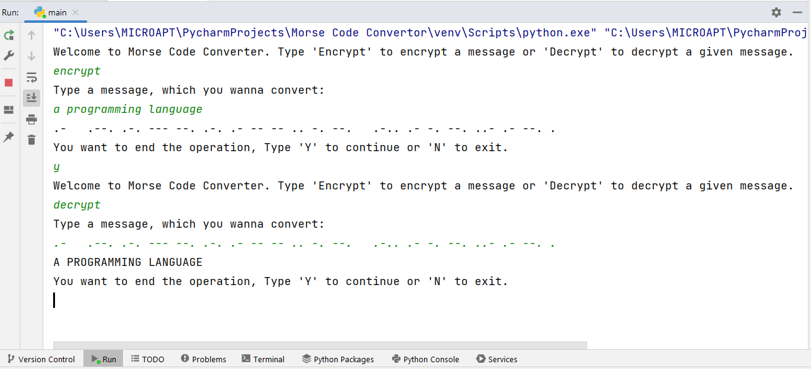

# Text to Morse Code Convertor
Morse code is a method used in telecommunication to encode text
characters as standardized sequences of two different signal durations,
called dots and dashes, or dits and dahs.
Morse code is named after Samuel Morse, one of the inventors of the telegraph.

## Concepts Covered
- Covered basic loop statements i.e. while and for loops.
- if else statements.
- Functions.
- Dictionaries.

## checkout

