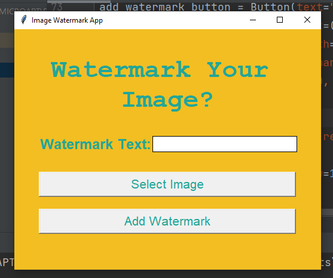

# Image Watermarking App
## Concepts Covered
- Created UI using Tkinter 
- Watermarked the Image using Pillow module
- Saved the output image in the current working directory as well as choosen location.

## Related Photos

