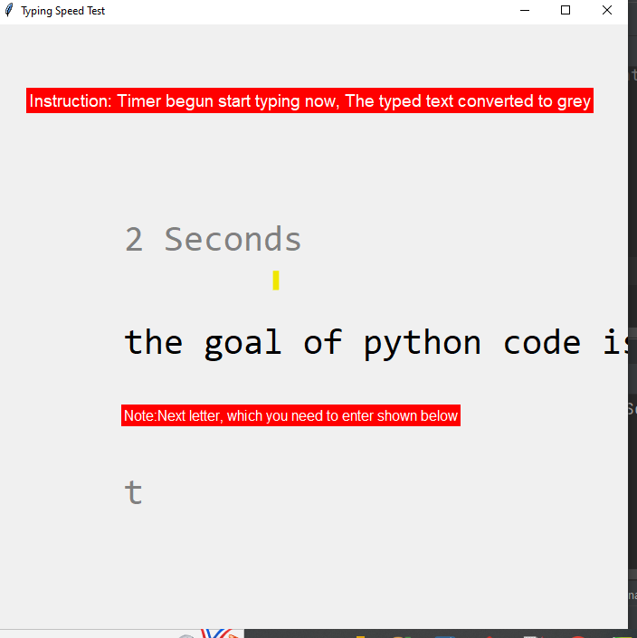
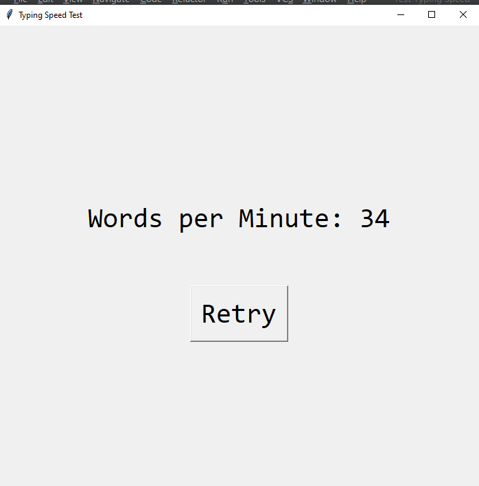

# Typing Speed test app
In nutshell, This project helps you to know your typing speed.
I think most jobs related to system usage, require you to maintain some 
standard typing speed in this competitive world. So from using this project 
you can test your typing speed and enhance it as well by keep 
practicing.

## Instructions to follow
- Once start a project, timer begins itself so you don't need to do anything, But start typing.
- The next letter, which you need to enter is shown as single letter grey color label.
- You must need to type correct sequence of characters in the sentence. Otherwise, it stays still until you enter a correct next charector.
- As you keep typing write sequence of charectors, the sentences will follow. 
- After one-minute timer, you will be shown number of words you managed to enter.

## Related Photos
### UI view photo 

### Result view photo

