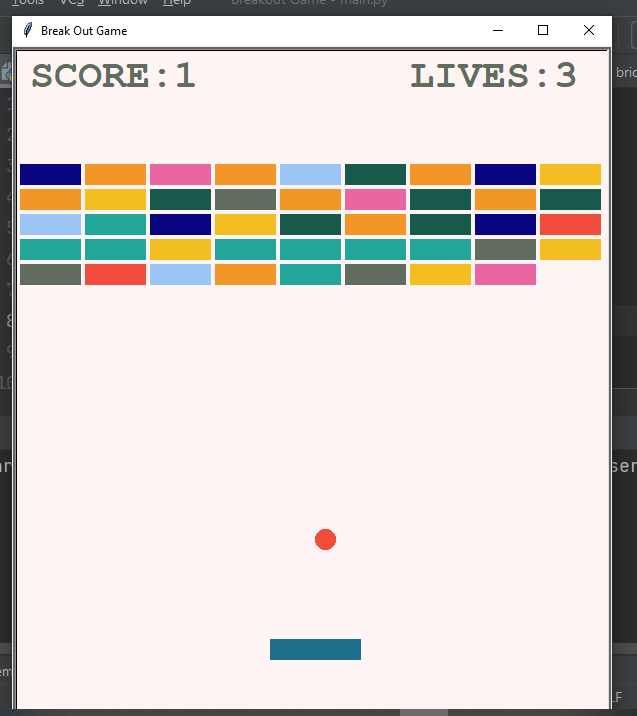

# Breakout Game
Breakout is an arcade video game developed and published by Atari, and released on May 13, 1976.It was designed by Steve Wozniak, based on conceptualization from Nolan Bushnell and Steve Bristow who were influenced by the seminal 1972 Atari arcade game Pong. In Breakout, a layer of bricks lines the top third of the screen and the goal is to destroy them all by repeatedly bouncing a ball off a paddle into them.

## Approach of a Project
- Breakdown total project into section such as ball module, scorecard module, paddle module, bricks module and finally main file which combines the all the modules.
- After separating into different modules built one by one like below
  1. Setup a screen
  2. Create a ball class and make it move
  3. create a bricks using for and while loops
  4. Create a paddle, and when ball intercept with paddle make it bounce back.
  5. When right and left hand side goes beyond some axis, make it to bounce back.
  6. when ball hit any of the brick, increase score by 1
  7. when ball goes beyond paddle axis you loose a life
  8. Make it if you loose all 3 lives game is over.

## Image of game shown below

