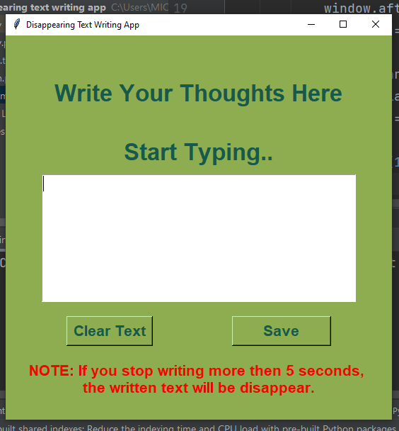

# Disappearing Text Writing App
For most writers, a big problem is writing block. 
Where you can't think of what to write and you can't write anything.

One of the most interesting solutions to this is a web app 
called The Most Dangerous Writing App, an online text editor
where if you stop writing, all your progress will be lost.

A timer will count down and when the website detects the user 
has not written anything in the last 5/10 seconds, it will delete
all the text they've written so far.

## How it Works?
You can keep on writing and If you wanted to save a written text,
you can save it through save button, which will create external text data file.
Alongside if you intend to clear the written text on your own before delete 
itself you can do it through clear text button, which will clear the text area.

## How I approached this project?
- divide whole projects into different  subsection, which will make it to follow easy.
- primarily, Setup a user interface.
- And then add functionality to it, through separate functions.

## Developed App Photo
