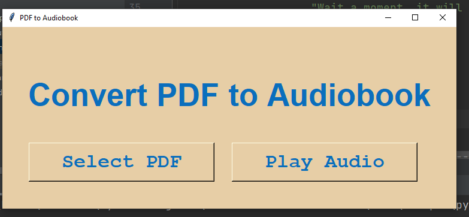

# Convert PDF to Audiobook
Too tired to read? Build a python script that takes a PDF file,
identifies the text and converts the text to speech. 
Effectively creating a free audiobook.

## How I approached this project
- Primarily, Setup a user interface (UI) using Tkinter
- Add functionality to it, through creating a functions
1. Created a function, to get a dynamic pdf file from local system, which will also converted to text.
2. And Created another function to convert output of earlier functions text into audio file using gtts module.

# UI Image

