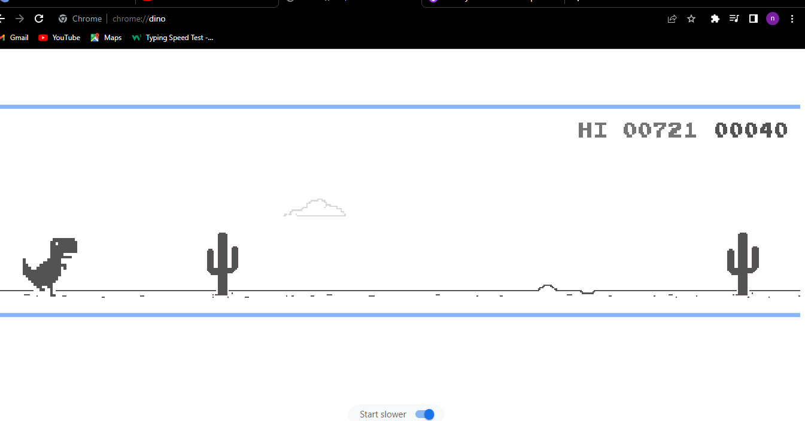

# Automate Chrome Dino Game
On Chrome, when you try to access a website and your internet is down, 
you see a little dinosaur. (Apparently because dinosaurs have short arms and they
"can't reach" your website.On this page, there is a hidden game, 
if you hit space bar you can play the T-rex run game.

Instead of playing game manually, I as a programmer made it automate.
So, when you find a cactus dino will jump automatically and find a bird, dino will head
down.

# How I Approached Project
In-front of cactus and bird created one imaginary rectangle, And when it clashes with 
cactus or bird, dino will respond respectively. (Whether it should head-down or jump).

# Game image
